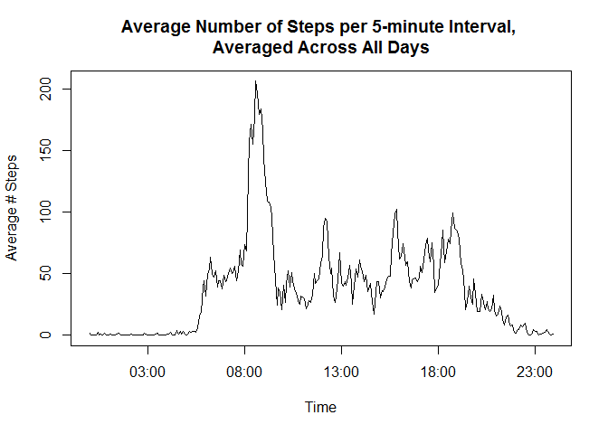

# Reproducible Research: Peer Assessment 1
# Introduction
This file contains the report for the entire assignment of the first peer assessment of the course ["Reproducible Research"](https://www.coursera.org/course/repdata) on Coursera. This report file and its accompanying .md and .html files will be submitted by pushing them into the forked assignment repository on GitHub. The full assignment submission will consist of the URL to this GitHub repository and the SHA-1 commit ID for the repository state.

# Data Description
This assignment makes use of data from a personal activity monitoring device. This device collects data at 5 minute intervals throughout the day. The data consists of two months of data from an anonymous individual collected during the months of October and November, 2012 and include the number of steps taken in 5 minute intervals each day. The dataset is stored in a comma-separated-value (.CSV) file and there are a total of 17,568 observations in this dataset.

The variables included in this raw dataset are:

* **steps:** Number of steps taken in a 5-minute interval (missing values are coded as NA),
* **date:** The date on which the measurement was taken in YYYY-MM-DD format,
* **interval:** Identifier for the 5-minute interval in which the measurement was taken

**Please note:** The GitHub repository for this assignment also contains the used dataset, so this report does not download the data separately.
If needed, the data used in this assignment can be found [on the course website, here](https://d396qusza40orc.cloudfront.net/repdata%2Fdata%2Factivity.zip).

# Software Environment
This section describes the software environment in which this assignment was made. The described environment is not the only one in which this report will work, but proper operation is not guaranteed for divergent systems.

* **Computer Architecture:** Intel Core i7 CPU, Intel HD Graphics GPU
* **Operating System:** 64-bit Windows 8
* **Software Toolchain:** R Studio
* **Supporting Software:** R packages: *knitr*, *ggplot2*, *stringr*, *plyr*, *lattice* loaded below

```r
library(knitr)
library(ggplot2)
library(stringr)
library(plyr)
library(lattice)
```
* **Dependencies:** The data must be stored in the same folder as this file. The data must still be in its original, zipped format.

The following R command prints further session info details.

```r
sessionInfo()
```

```
## R version 3.2.2 (2015-08-14)
## Platform: x86_64-w64-mingw32/x64 (64-bit)
## Running under: Windows 8 x64 (build 9200)
## 
## locale:
## [1] LC_COLLATE=Dutch_Belgium.1252  LC_CTYPE=Dutch_Belgium.1252   
## [3] LC_MONETARY=Dutch_Belgium.1252 LC_NUMERIC=C                  
## [5] LC_TIME=Dutch_Belgium.1252    
## 
## attached base packages:
## [1] stats     graphics  grDevices utils     datasets  methods   base     
## 
## other attached packages:
## [1] lattice_0.20-33 plyr_1.8.3      stringr_1.0.0   ggplot2_1.0.1  
## [5] knitr_1.11     
## 
## loaded via a namespace (and not attached):
##  [1] Rcpp_0.12.1      digest_0.6.8     MASS_7.3-43      grid_3.2.2      
##  [5] gtable_0.1.2     magrittr_1.5     evaluate_0.8     scales_0.3.0    
##  [9] stringi_0.5-5    reshape2_1.4.1   rmarkdown_0.8    proto_0.3-10    
## [13] tools_3.2.2      munsell_0.4.2    yaml_2.1.13      colorspace_1.2-6
## [17] htmltools_0.2.6
```
# Assignment
This assignment is described in multiple parts. The following sections each represent such a part, and attempt to give a proper answer to the questions posed.

## Loading and preprocessing the data
This section describes the code to:

1. Load the data:

```r
# Unzip the file containing the data, then read the data from the csv
data <- read.csv(unz('activity.zip', 'activity.csv'))
# Show some of the data 
head(data)
```

```
##   steps       date interval
## 1    NA 2012-10-01        0
## 2    NA 2012-10-01        5
## 3    NA 2012-10-01       10
## 4    NA 2012-10-01       15
## 5    NA 2012-10-01       20
## 6    NA 2012-10-01       25
```
2. Process/transform the data into the format suitable for the analysis in this report:

For now, NA values are kept in the dataset, as some parts of the assignment require their presence.

```r
library(stringr)
# Pad the interval identifiers to 4 characters, eg. 130 -> 0130
data$datetime <- str_pad(data$interval, 4, "left", pad="0")
# Convert to a POSIX format with a dummy date for plotting
data$datetime <- as.POSIXct(data$datetime, format="%H%M")
# Convert the dates to type Date
data$date <- as.Date(data$date, format = "%Y-%m-%d")
# Show some of the data
head(data)
```

```
##   steps       date interval            datetime
## 1    NA 2012-10-01        0 2015-11-06 00:00:00
## 2    NA 2012-10-01        5 2015-11-06 00:05:00
## 3    NA 2012-10-01       10 2015-11-06 00:10:00
## 4    NA 2012-10-01       15 2015-11-06 00:15:00
## 5    NA 2012-10-01       20 2015-11-06 00:20:00
## 6    NA 2012-10-01       25 2015-11-06 00:25:00
```
**Please note:** while the above data is not 'tidy' due to the overlapping meaning of the *date*, *interval* and *datetime* columns, this format is suitable for the analysis, which was the task at hand.

## What is the mean total number of steps taken per day?
Please note that this part of the assignment ignores the missing values in the dataset.

1. Calculate the total number of steps taken per day.

```r
# Remove rows that contain NA values
dataC <- data[complete.cases(data),]
# Calculate the total number of steps taken for each day
agg <- aggregate(steps ~ date, dataC, FUN=sum)
# Show some values for the total number of steps per day
head(agg)
```

```
##         date steps
## 1 2012-10-02   126
## 2 2012-10-03 11352
## 3 2012-10-04 12116
## 4 2012-10-05 13294
## 5 2012-10-06 15420
## 6 2012-10-07 11015
```

2. Make a [histogram](http://www.shodor.org/interactivate/discussions/HistogramsVsBarGraph/) of the total number of steps taken each day.

```r
library(ggplot2)
# Plot a histogram of the total number of steps taken each day
qplot(agg$steps, binwidth=range(agg$steps)[2]/30) + 
     geom_histogram(aes(fill=..count..), 
                    binwidth=range(agg$steps)[2]/30) +
     xlab("Total Number of Steps") + 
     ylab("Prevalency Count of Total # of Steps") +
     ggtitle("Histogram of Total # of Steps per Day") 
```

 

3. Calculate and report the mean and median of the total number of steps taken per day.

```r
# Calculate the mean of these total numbers of steps taken
mn <- mean(agg$steps)
# Calculate the median of these total numbers of steps taken
md <- median(agg$steps)
```
The mean number of total steps taken is: 10766.19.

The median number of total steps taken is: 10765.

## What is the average daily activity pattern?
1. Make a time series plot of the 5-minute interval (x-axis) and the average number of steps taken, averaged across all days (y-axis)

```r
# Calculate the average number of steps taken per 5-minute
# time interval, for each day
intervalAgg <- aggregate(steps ~ interval + datetime,
                         data, FUN=mean)
# Plot this as a time series
plot(intervalAgg$datetime,intervalAgg$steps,type='l',
     xlab='Time',ylab='Average # Steps',
     main=paste(c("Average Number of Steps per 5-minute Interval, \n",
                "Averaged Across All Days"), collapse = ""))
```

 

2. Which 5-minute interval, on average across all the days in the dataset, contains the maximum number of steps?

```r
# Get the row from the aggregated data for which 
# the average number of steps is maximal
mxint <- intervalAgg[which.max(intervalAgg$steps),]
```
The 5-minute interval with identifier 835, representing the time interval starting at 08:35, has the maximum average numbers of steps across all the days, namely 206.1698113 steps.

## Imputing missing values

There are a number of days/intervals where there are missing values (coded as NA). The presence of missing days may introduce bias into some calculations or summaries of the data.

1. Calculate and report the total number of missing values in the dataset (i.e. the total number of rows with NAs)

```r
# Find the rows with at least one NA
dataNA <- data[(!complete.cases(data)),]
# Store the number of rows with NAs
nNAs <- nrow(dataNA)
```
There are 2304 rows with NAs.

2. Devise a strategy for filling in all of the missing values in the dataset. The strategy does not need to be sophisticated. For example, you could use the mean/median for that day, or the mean for that 5-minute interval, etc.

The strategy chosen for filling in the missing values utilizes the mean for the 5-minute interval.

3. Create a new dataset that is equal to the original dataset but with the missing data filled in.


```r
library(plyr)
# Create a function that replaces x with the mean if x is NA
impmean <- function(x) replace(x, is.na(x), mean(x, na.rm = TRUE))
# Create a new dataset by imputing the missing values
impData <- ddply(data, ~ interval, transform, steps = impmean(steps))
# Change the ordering of the data back to original (ddply broke it)
impData <- impData[order(impData$date), ]
# Show some of the data
head(impData)
```

```
##         steps       date interval            datetime
## 1   1.7169811 2012-10-01        0 2015-11-06 00:00:00
## 62  0.3396226 2012-10-01        5 2015-11-06 00:05:00
## 123 0.1320755 2012-10-01       10 2015-11-06 00:10:00
## 184 0.1509434 2012-10-01       15 2015-11-06 00:15:00
## 245 0.0754717 2012-10-01       20 2015-11-06 00:20:00
## 306 2.0943396 2012-10-01       25 2015-11-06 00:25:00
```

4. Make a histogram of the total number of steps taken each day and Calculate and report the mean and median total number of steps taken per day. Do these values differ from the estimates from the first part of the assignment? What is the impact of imputing missing data on the estimates of the total daily number of steps?

```r
# Calculate the total number of steps taken for each day
agg2 <- aggregate(steps ~ date, impData, FUN=sum)
# Calculate the mean of these total numbers of steps taken
mn2 <- mean(agg2$steps)
# Calculate the median of these total numbers of steps taken
md2 <- median(agg2$steps)
# Plot a histogram of the total number of steps taken each day
qplot(agg2$steps, binwidth=range(agg2$steps)[2]/30) + 
     geom_histogram(aes(fill=..count..), 
                    binwidth=range(agg2$steps)[2]/30) +
     xlab("Total Number of Steps") + 
     ylab("Prevalency Count of Total # of Steps") +
     ggtitle("Histogram of Total # of Steps per Day")
```

 

The mean number of total steps taken is now: 10766.19.

The median number of total steps taken is now: 10766.19.

The impact of imputing missing data using means on the estimates of the total daily number of steps is that the prevalence of values close to common means has increased, while values that never occur as a mean have remained unchanged. In other words, the prevalence of common bins in the histogram has increased while the prevalence of rare bins did not. This has caused a more extreme dichotomy between common and rare values, represented as a more bell-like curve in the histogram. The distribution has thus been made more like a normal distribution by imputing missing data with means.

## Are there differences in activity patterns between weekdays and weekends?

**Please note:** this part of the assignment uses the dataset with the filled-in missing values created above.

1. Create a new factor variable in the dataset with two levels - "weekday" and "weekend" indicating whether a given date is a weekday or weekend day.


```r
# Add the factor variable
impData$daytype <- as.factor(ifelse(format(impData$date, "%u") 
                                            %in% c(6, 7), 
                                            "weekend", "weekday"))
# Show some data
head(impData)
```

```
##         steps       date interval            datetime daytype
## 1   1.7169811 2012-10-01        0 2015-11-06 00:00:00 weekday
## 62  0.3396226 2012-10-01        5 2015-11-06 00:05:00 weekday
## 123 0.1320755 2012-10-01       10 2015-11-06 00:10:00 weekday
## 184 0.1509434 2012-10-01       15 2015-11-06 00:15:00 weekday
## 245 0.0754717 2012-10-01       20 2015-11-06 00:20:00 weekday
## 306 2.0943396 2012-10-01       25 2015-11-06 00:25:00 weekday
```

2. Make a panel plot containing a time series plot (i.e. type = "l") of the 5-minute interval (x-axis) and the average number of steps taken, averaged across all weekday days or weekend days (y-axis). 


```r
library(lattice)
# Calculate the average number of steps taken per 5-minute
# time interval, for each day
intervalAgg2 <- aggregate(steps ~ interval + datetime + daytype,
                         impData, FUN=mean)
#Plot this as a time series panel plot
xyplot(intervalAgg2$steps~intervalAgg2$datetime|intervalAgg2$daytype,
       xlab='Time', ylab='Average # Steps', type='l',
       main=paste(c("Average Number of Steps per 5-minute Interval, \n",
                  "Averaged Across All Days, \n",
                  "For Weekdays vs. Weekends"), collapse = ""),
       layout=c(1,2),
       scales = list(x = list(format = "%H:%M")))
```

 
